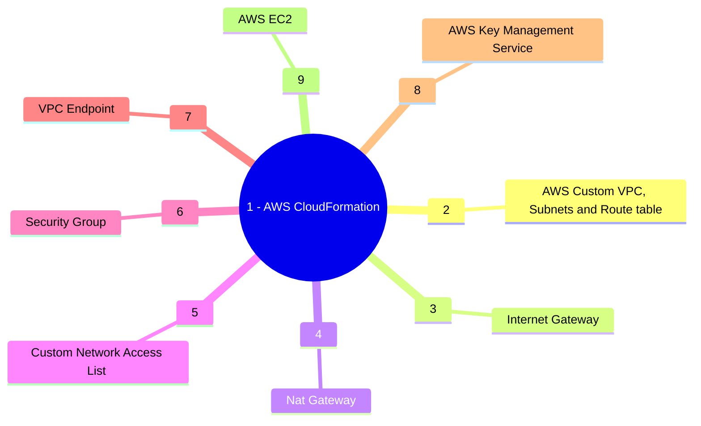

&nbsp;&nbsp;&nbsp;&nbsp;&nbsp;&nbsp;&nbsp;&nbsp;&nbsp;

# Project Tarius: AWS Serverless Real Time Data Load to DynamoDB.

Creating a custom VPC with public and private subnets and nat gateway to access internet from private subnet. Create VPC endpoint for S3 and KMS and create EC2 instances in the public and private subnets and test the connectivity.

## Description

This repo creates a custom VPC with four public and private subnets in four different availability zones. The CloudFormation template has a parameter to enable IPV6 CI/CD block. Internet connectivity is enabled in the private subnets are using Nat Gateway. Two EC2 instances and spinned up in piblic and private subnets.


### Services Used



* Repository Directory Structure
```
tarius-repo/
├─ .git
├─ .github/
│  ├─ workflows/
│  │  ├─ delete-stack.yaml  (**created by the template)
│  │  ├─ deploy-stack.yaml  (**created by the template)
├─ architecture-diagram/
│  ├─ project-architecture-diagram.png
├─ cft/
│  ├─ project-root-stack.yaml
│  ├─ nested-stacks/
│  │  ├─ service1-nested-stack.yaml  (service names are lambda, s3,sns..etc)
│  │  ├─ service2-nested-stack.yaml
│  │  ├─ service3-nested-stack.yaml
├─ src/
│  ├─ lambda-function-base-name.py
├─ kms-policy/
│  ├─ kms-key-policy.json (required for documentation purpose only)
├─ params/
│  ├─ cfn-parameters.json
├─ .gitignore
├─ README.md

```

## Authors

Contributors names and contact info

Subhamay Bhattacharyya  - [subhamay.aws@gmail.com]

## Version History

* 0.1
    * Initial Release

## License

This project is licensed under Subhamay Bhattacharyya. All Rights Reserved.

## Acknowledgments

